### Test Case ID: TC01
#### Title: Verify successful login with valid email and password
#### Priority: P0
#### Preconditions:
The user is already registered with the following credentials:  
Login data: email:"irakozak96@gmail.com", password: "Password123";
Full name: "Iryna Kozak".
#### Steps:
1. Navigate to https://university.engenious.io/  
   1.1 __ER:__ User is redirected to the university's homepage  
   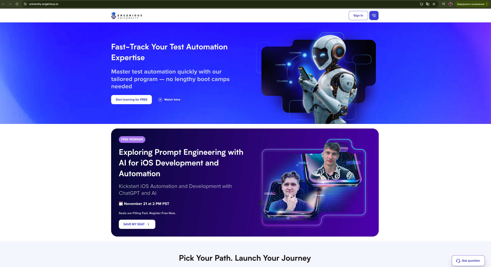    
2. Click "Sign In" button in the header  
   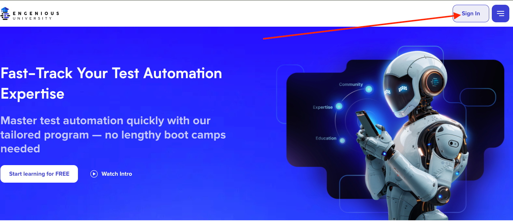 
   2.1 __ER:__ User is redirected to "/registration" page  
   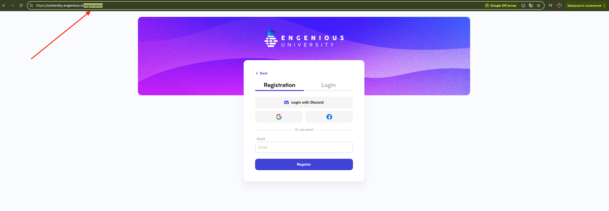    
3. Click "Login" button  
   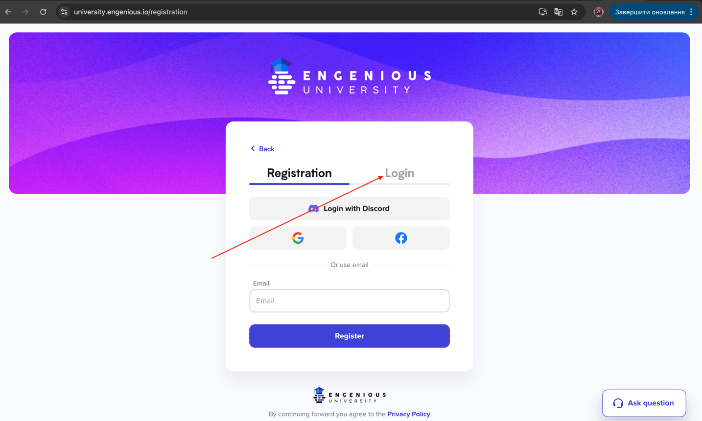 
   3.1 __ER:__ User is redirected to "/login" page  
   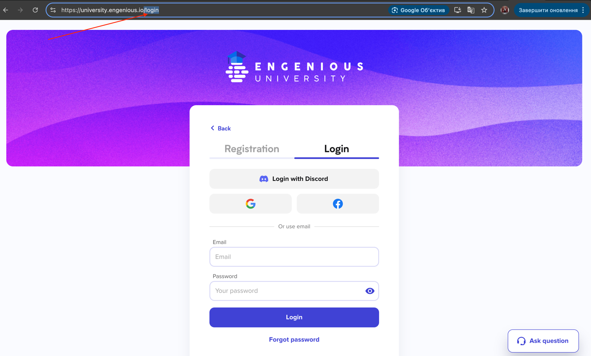    
4. Enter "irakozak96@gmail.com" in the Email field  
     
   4.1 __ER:__ Email field is filled with "irakozak96@gmail.com" value    
5. Enter "Password123" in the Password field  
   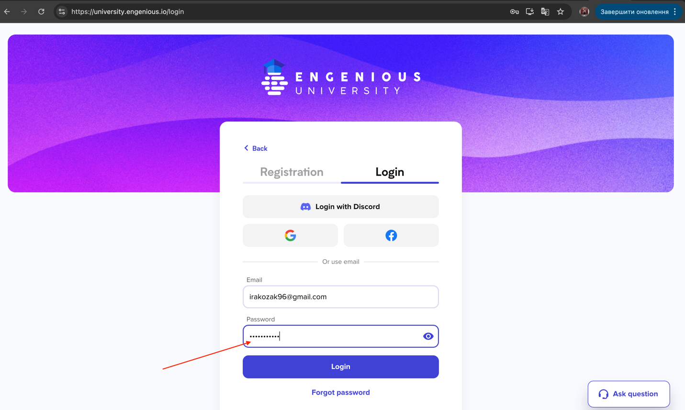  
   5.1 __ER:__ Password field is filled with "Password123" value and the entered characters are displayed as hidden (represented by dots)    
6. Click "Login" button  
   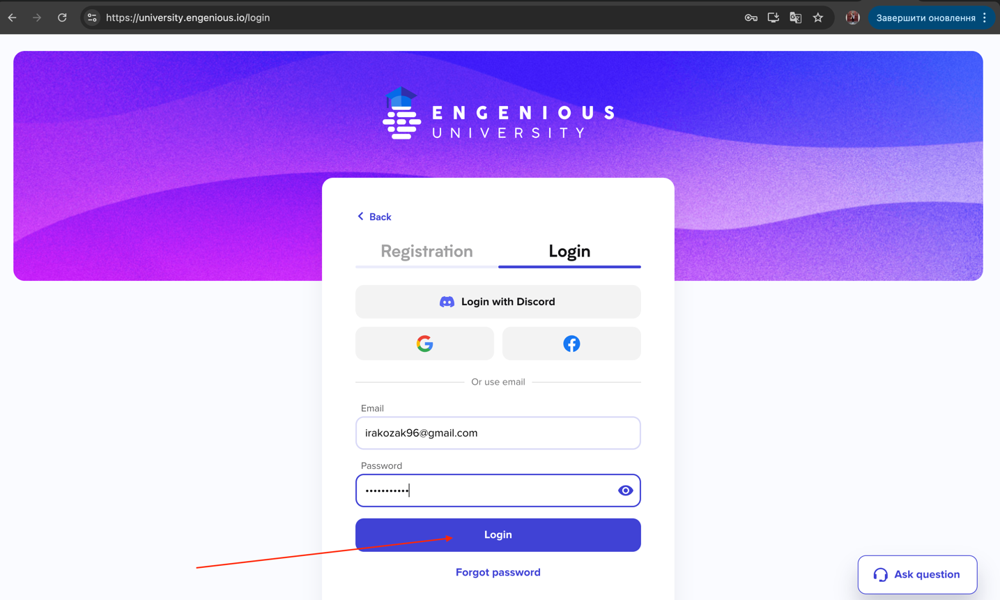  
   6.1 __ER:__ User is redirected to welcome page  
   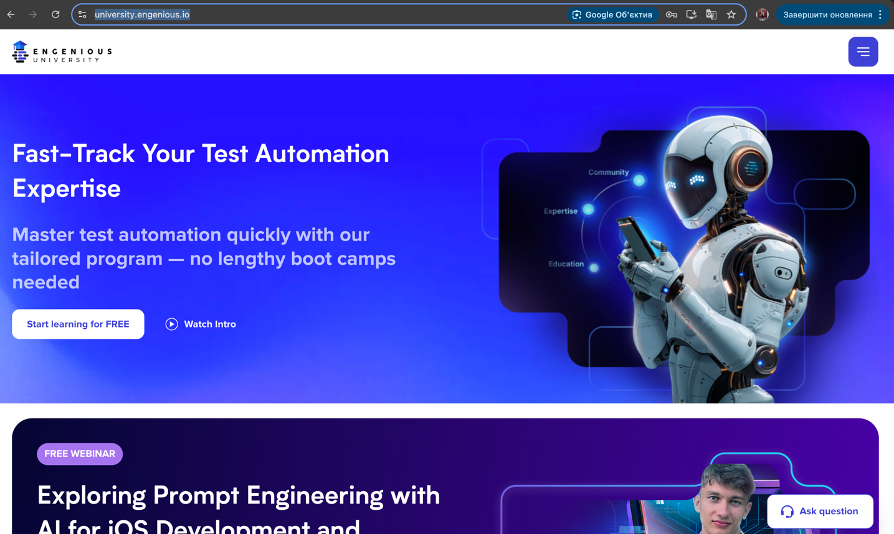    
7. Click on Menu Toggle in the header  
   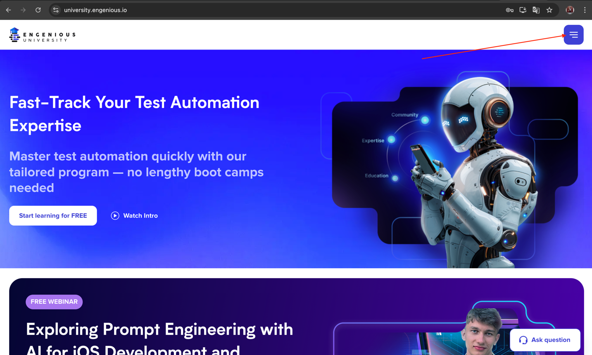  
   7.1 __ER:__ Navigation Bar is opened with user card displayed, which contains full name "Iryna Kozak"  
   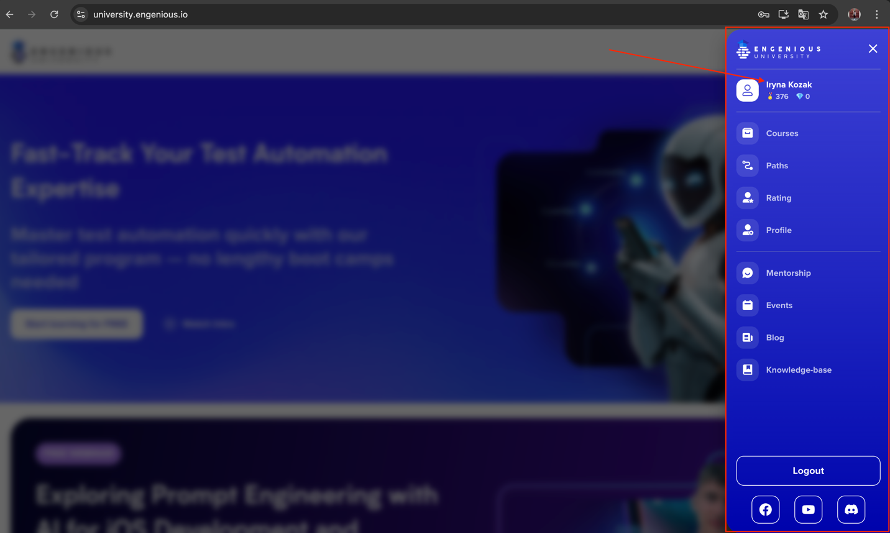    
#### Comments:
Please note that during test execution, the Webinar modal window might appear at any step (as per screenshot below), specifically 10 seconds after the page is opened. If the modal appears, close it by clicking on the close icon (X) before continuing with the next steps in the test. 
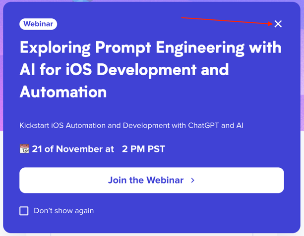