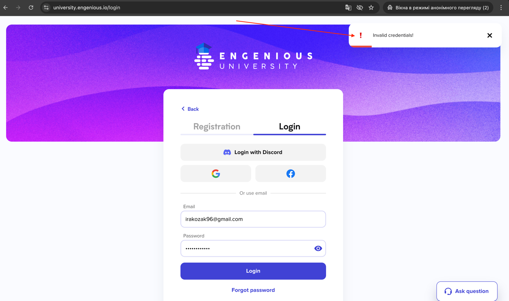

### Test Case ID: TC02
#### Title: Verify error toast appears when entering an incorrect password for a valid email
#### Priority: P0
#### Preconditions:
The user is already registered with the following credentials:
email:"irakozak96@gmail.com", password: "Password123" 
1. Navigate to https://university.engenious.io/login 
2. Enter "irakozak96@gmail.com" in the Email field
#### Steps:
1. Enter "InvalidPassword123" in the Password field  
1.1 __ER:__ Password field is filled with invalid value, namely 'InvalidPassword123' and the entered characters are displayed as hidden (represented by dots)    
2. Click "Login" button  
2.1 __ER:__ Error toast appears in the top right corner of the screen, displaying the message "Invalid credentials!" 
   

