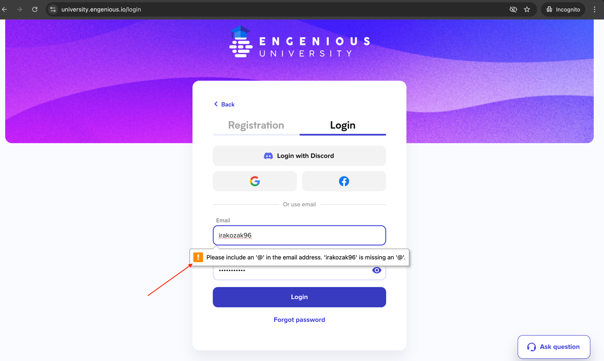

### Test Case ID: TC03
#### Title: Verify native browser validation message appears when entering invalid email
#### Priority: P0
#### Preconditions:
1. Navigate to https://university.engenious.io/login
2. Fill Password field with "Password123" value

#### Steps:
1. Enter "irakozak96" in the Email field  
   1.1 __ER:__ Email field is filled with "irakozak96" value    
2. Click "Login" button  
   2.1 __ER:__ Native browser validation message appears under the email field, displaying the message "Please include an '@' in the email address. 'irakozak96' is missing an '@'."  
   