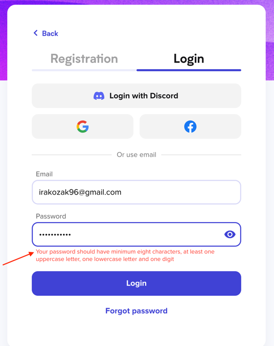

### Test Case ID: TC04
#### Title: Verify login failure when an SQL injection is entered in the password field
#### Priority: P0
#### Preconditions:
The user is already registered with the following email: "irakozak96@gmail.com" 
1. Navigate to https://university.engenious.io/login
2. Enter "irakozak96@gmail.com" in the "Email" field
#### Steps:
1. Enter "' OR '1'='1" in the Password field 
   1.1 __ER:__ Password field is filled with an SQL injection, namely "' OR '1'='1" value and the entered characters are displayed as hidden (represented by dots)    
2. Click "Login" button  
2.1 __ER:__ User is not logged in. Error toast is shown in the top right corner of the screen, displaying the message "Invalid credentials!" 

#### Note:
Currently, Actual Result differs from Expected result.  
__AR:__ Validation message appears under the password field as following: "Your password should have minimum eight characters, at least one uppercase letter, one lowercase letter and one digit".   
  
__Issue:__ This behavior is not secure, as it reveals sensitive information about the password policy, potentially aiding attackers in crafting more effective attack strategies.   
__Improvement Required:__ The system should be updated to show a more generic error message like "Invalid credentials!" without revealing specific details on password field and its strength requirements. 