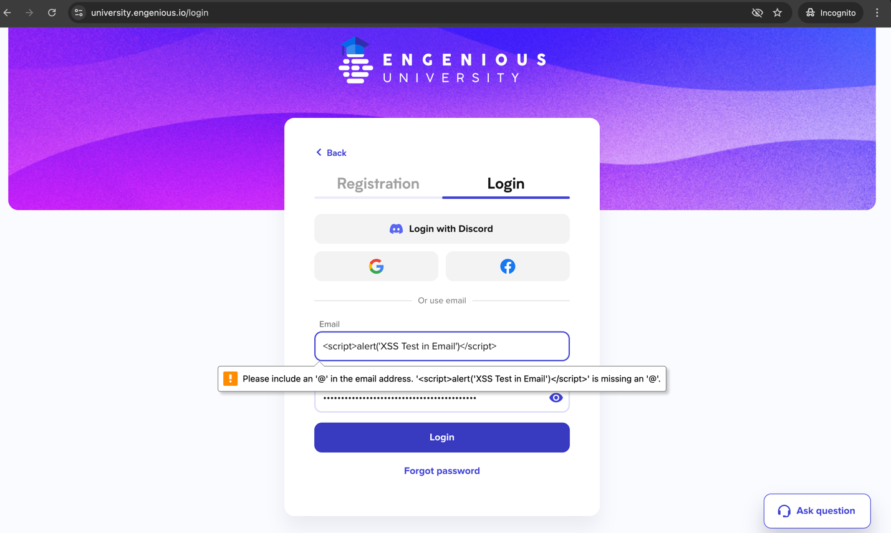

### Test Case ID: TC05
#### Title: Verify system's protection against XSS attacks in email and password fields
#### Priority: P0
#### Preconditions:
1. Navigate to https://university.engenious.io/login
#### Steps:
1. In the "Email" field, enter the following XSS payload: 
```<script>alert('XSS Test in Email')</script>```<br>
1.1 __ER:__ "Email" field is filled with XSS payload <br><br>
2. In the "Password" field, enter the following XSS payload:
```<script>alert('XSS Test in Email')</script>```<br>
2.1 __ER:__ "Password" field is filled with XSS payload <br><br>
3. Click "Login" button <br>
3.1 __ER:__ The injected scripts are not executed in either the email or password fields. An alert messages do not appear. Native browser validation message appears for "Email" field. <br>
   